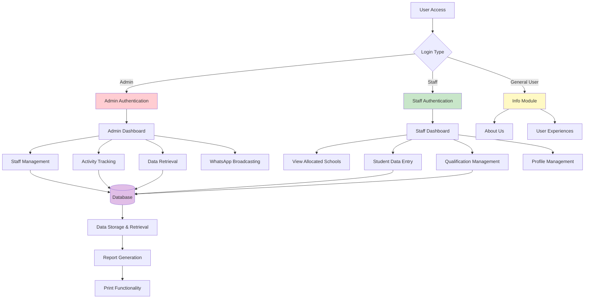
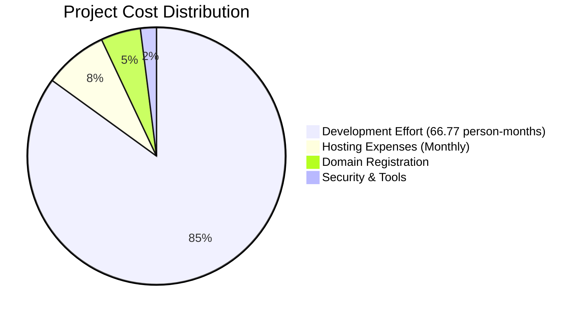

# ADMENT: A Student Record Management System 🚀


## Overview

Welcome to **ADMENT (Admission Management)**, a robust and intuitive web-based student record management system meticulously designed to revolutionize admission processes and significantly boost administrative efficiency within educational institutions. Developed for the esteemed Matoshri Institute of Technology, Yeola, ADMENT champions a digitized, secure, and highly efficient approach to managing student records.

---

## ✨ Why ADMENT?

In today's fast-paced educational landscape, manual processes are a bottleneck. ADMENT steps in as your ultimate solution to:

- **Streamline Admissions:** Digitize and automate every step of the admission journey.
- **Enhance Efficiency:** Drastically reduce administrative workload and human error.
- **Secure Data:** Ensure the integrity and confidentiality of sensitive student information.
- **Empower Staff:** Provide powerful tools for managing records, tracking activities, and communicating effectively.
- **Foster Transparency:** Offer clear insights into student data and staff performance.

---

## 🎯 Project Details

| Detail | Description |
|:-------|:------------|
| **Institution** | Matoshri Institute of Technology, Yeola (Nashik) |
| **Department** | Computer Engineering |
| **Academic Year** | 2023-2024 |
| **Project Guide** | Miss. Ghodke R.B. |
| **Development Duration** | ~11.35 Months |
| **Team Size** | 4 Dedicated Members |

---

## 🏆 Key Achievements & Recognition

ADMENT isn't just a project; it's a testament to innovation and academic excellence!

- **Academic Recognition:** Our well-defined problem statement was lauded by Principal Mr. Gujarathi G.S.
- **Published Paper:** "ADMENT: Student Record Management System" published in IJRMETS (International Journal of Research in Management, Economics and Technology Studies), Volume 06, Issue 02, February 2024. This is a peer-reviewed publication with a significant impact factor!
- **Competition Successes:**
  - **4th Prize** at the prestigious Idea Hackathon, SND RC&COE Yeola.
  - Active participation in the Tantra Sangram Project Exhibition at SND Polytechnic.
- **Institutional Support:** Fully sponsored by Matoshri Education Society, including secured `adment.in` domain with dedicated hosting!

---

## System Flow Diagram
<div align="center">



</div>

## 💻 Technology Stack

Powering ADMENT is a robust and modern technology stack designed for performance, scalability, and maintainability.

### Frontend Technologies
- HTML5
- CSS3
- JavaScript
- Bootstrap
- AngularJS

### Backend Technologies
- ASP.NET
- C#.NET

### Database
- MS SQL Server 2019

### Development Tools
- Visual Studio 2012

### Hosting
- Microsoft IIS Server
- Microsoft Azure

---

## 🏗️ System Architecture

ADMENT is built upon a standard Three-Tier Architecture, ensuring clear separation of concerns, flexibility, and scalability.

```
┌─────────────────────────────────────┐
│      Presentation Layer             │
│    (AngularJS + Bootstrap)          │
├─────────────────────────────────────┤
│     Business Logic Layer            │
│     (ASP.NET + C#.NET)              │
├─────────────────────────────────────┤
│       Data Access Layer             │
│     (MS SQL Server 2019)            │
└─────────────────────────────────────┘
```

### User Roles
- **Admin Module**
- **Staff Module**
- **Info Module**

---

## ⚙️ Project Workflow

Our development journey for ADMENT followed a meticulously planned 8-phase approach, ensuring comprehensive coverage from conception to deployment.

### Development Phases
1. **Planning** (25 days)
2. **Data Collection** (15 days)
3. **Report Development** (10 days)
4. **Implementation** (20 days)
5. **Material Procurement** (15 days)
6. **Manufacturing** (45 days)
7. **Testing & Trials** (10 days)
8. **Documentation** (15 days)


## ✨ Features at a Glance

ADMENT is packed with powerful features tailored for different user roles:

### Admin Module
- **Staff Management:** Effortlessly create, modify, and delete staff accounts.
- **Role Assignment:** Intelligently allocate schools and define responsibilities for staff.
- **Activity Tracking:** Gain insights by monitoring staff performance and data entry activities.
- **Data Management:** Securely retrieve and download crucial data from allocated schools.
- **Communication:** Instantly send custom messages via integrated WhatsApp broadcasting.

### Staff Module
- **School Management:** Conveniently view and manage all allocated schools.
- **Student Data Entry:** Seamlessly input student information including names, addresses, and mobile numbers.
- **Qualification Management:** Easily specify and modify qualification levels for students.
- **Profile Management:** Keep personal information and passwords up-to-date with ease.
- **Data Export:** View and print submitted data for record-keeping.

### Info Module
- **Static Pages:** Access essential "About Us" and institutional information.
- **User Experiences:** Read inspiring testimonials and experiences from other users.

---

## 🛠️ Installation & Setup

Get ADMENT up and running in no time!

### Prerequisites
Ensure you have the following installed:
- **Operating System:** Windows 10 or higher
- **IDE:** Visual Studio 2012 or later
- **Database:** MS SQL Server 2019 Express
- **Web Server:** IIS Server
- **Hardware:** Minimum 4GB RAM, i3 processor, 128GB HDD

### Installation Steps

1. **Clone the Repository:**
   

2. **Open in Visual Studio:** Open the cloned project in Visual Studio.

3. **Restore NuGet Packages:** Allow Visual Studio to restore all necessary NuGet packages.

4. **Configure Database:** Update the database connection string in web.config to match your SQL Server setup.

5. **Run Database Scripts:** Execute the provided SQL scripts to create the necessary database schema and tables.

6. **Build & Deploy:** Build the project and deploy it to your IIS server.

### Database Configuration
The database schema is meticulously designed to handle all aspects of student record management, including:
- Student Information Tables
- Staff Account Management
- User Authentication
- Activity Tracking
- Application Settings

---

## ✅ Testing

Our commitment to quality is paramount. ADMENT underwent a rigorous and comprehensive testing phase to ensure reliability, security, and performance.

### Test Coverage Distribution
- **Unit Testing:** 40%
- **Integration Testing:** 25%
- **User Acceptance Testing:** 20%
- **Security Testing:** 10%
- **Performance Testing:** 5%

### Test Results Summary
| Metric | Value |
|--------|-------|
| Total Test Cases | 17 |
| Passed | 17 (100%) |
| Failed | 0 (0%) |
| Coverage Areas | Authentication, Data Management, Security, Performance |

---

## 💰 Cost Analysis
<div align="center">


</div>
### Operational Costs
| Component | Cost |
|-----------|------|
| Windows Shared Hosting | ₹399/month |
| Domain (adment.in) | ₹999/year |
| Development Tools | Free (Community Edition) |
| **Total Monthly Cost** | **₹482.25** |

---

## 📈 Future Scope

ADMENT is designed for continuous evolution. Our roadmap includes exciting enhancements to push the boundaries of student record management.

### Planned Enhancements
- **Advanced Analytics:** Integration of powerful reporting tools with interactive data visualization.
- **Mobile Application:** Development of a cross-platform mobile application for on-the-go access.
- **AI Integration:** Leverage AI for automated document verification and personalized student insights.
- **Payment Gateway:** Seamless online fee payment integration.
- **Blockchain:** Implementation of a secure blockchain-based credential verification system.
- **LMS Integration:** Seamless data exchange with popular Learning Management Systems.

### Scalability Roadmap
```
Current State → Multi-Institution → Regional → National
(Single Institution)    Support    Implementation  Education Platform
```

---

## 🤝 Contributors

This project is the result of dedicated teamwork and invaluable academic guidance.

### Development Team
- **Mr. Deshmukh Aanish Rajendra** - Lead Developer 👨‍💻
- **Mr. Abak Sahil Sunil** - Backend Developer ⚙️
- **Miss. Sawkar Kalyani Dipak** - Frontend Developer 🎨
- **Mr. Tribhuvan Satish Dadasaheb** - Database Designer 🗄️

### Academic Supervision
- **Project Guide:** Miss. Ghodke R.B.
- **HOD:** Mr. Ghorpade M.S.
- **Principal:** Mr. Gujarathi G.S.
- **External Examiner:** Mr. Gujarathi G.S.

---

## ✅ Program Outcomes & Course Outcomes Achieved

ADMENT proudly addresses and achieves key academic objectives:

### Program Outcomes Addressed (PO)
- **PO 3:** Design/development of solutions for complex technical problems.
- **PO 4:** Proficient use of engineering tools, experimentation, and testing.
- **PO 5:** Application of engineering practices for societal benefit and sustainability.
- **PO 6:** Effective project management and team leadership.

### Course Outcomes Achieved (CO)
- Successful individual and team implementation of technical solutions.
- Proficiency in information collection and problem-solving methodologies.
- Adherence to quality assurance principles and effective decision-making.
- Consideration of ethical implications and social impact assessment.
- Demonstration of effective communication and leadership skills.

---

## 🏛️ Institution Details

- **Institution:** Matoshri Institute of Technology, Yeola, Nashik, Maharashtra
- **Affiliation:** Maharashtra State Board of Technical Education, Mumbai
- **Project Year:** 2023-2024

---

## 📝 License

This project is developed as part of academic curriculum at Matoshri Institute of Technology, Yeola.
